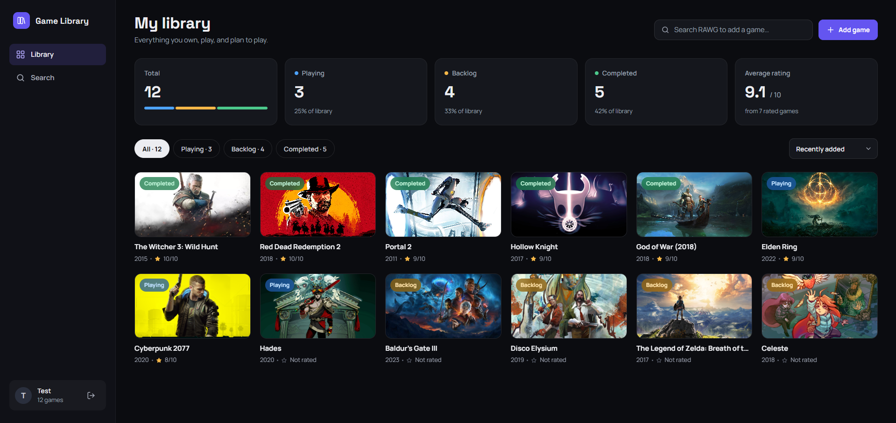
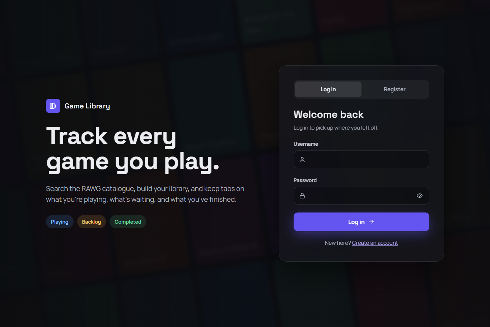
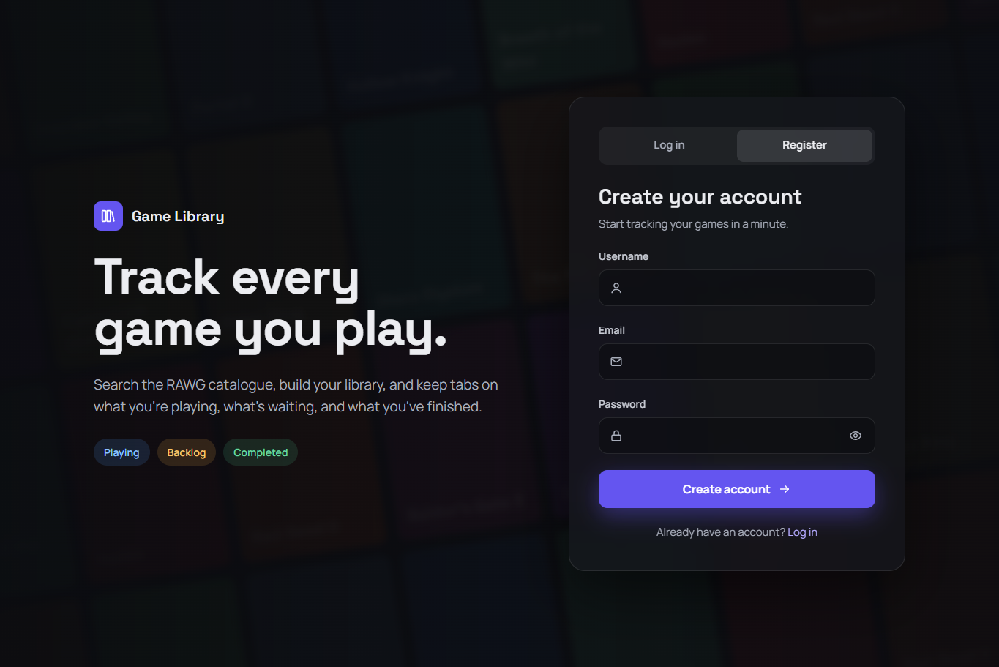
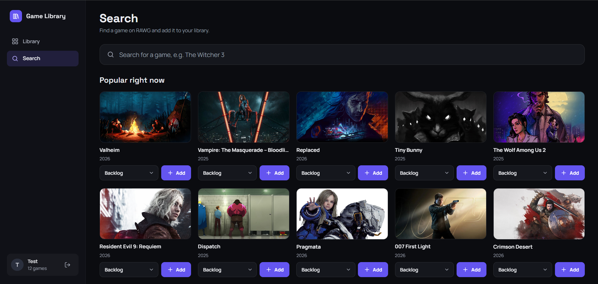
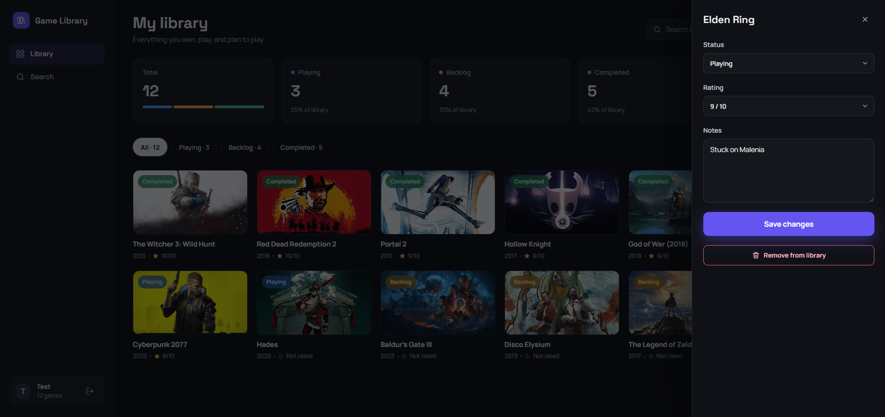
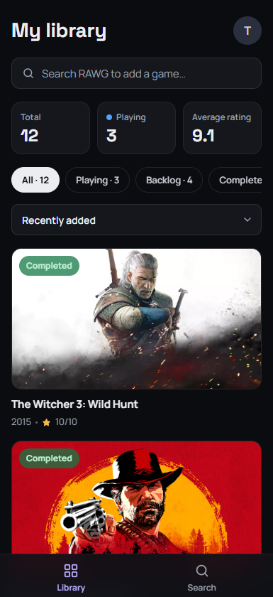
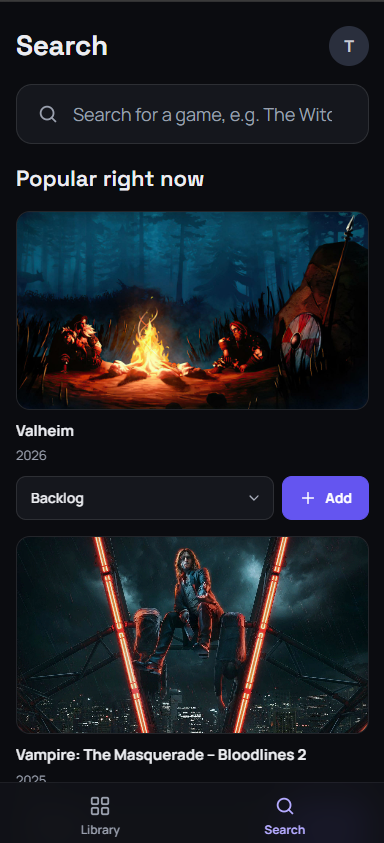
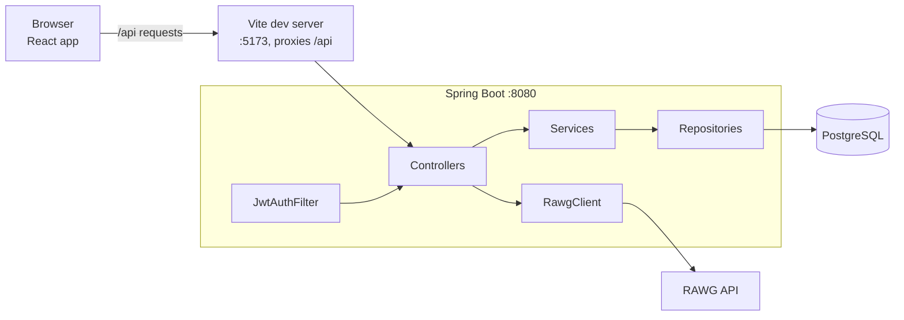
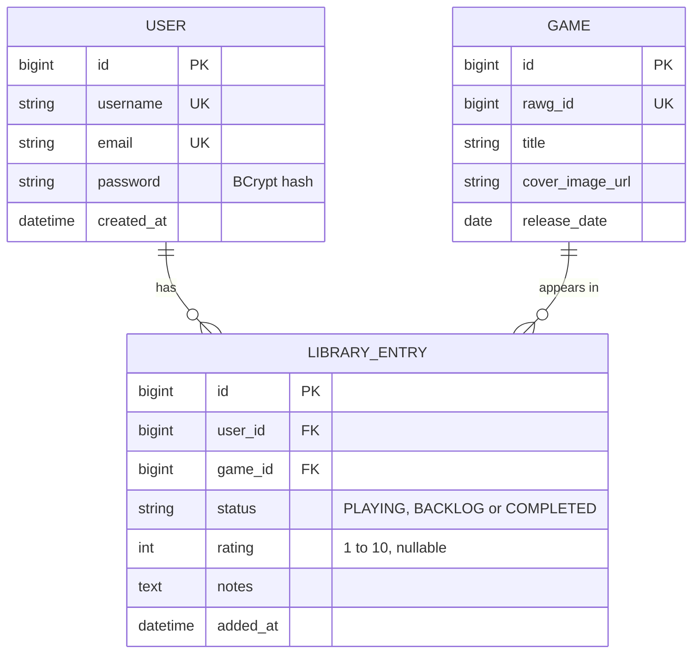

# Game Library Tracker

A full-stack web app for tracking your video game library: a **Java / Spring Boot** REST API with **PostgreSQL** and JWT auth, a **React + TypeScript** frontend, built with **Maven**, tested with **JUnit**, and developed with **Git** feature branches and pull requests.



## Features

- **Accounts with JWT authentication.** Register and log in; every other endpoint needs a token.
- **Game search.** Live search of the RAWG catalogue, debounced, with the query kept in the URL.
- **Discovery.** "Popular right now" and "All-time greats" lists on the Search page before you type.
- **Personal library.** Add a game with a status (Playing, Backlog, Completed), then set a rating from 1 to 10 and notes.
- **Stats.** Totals per status, a split bar and the average rating.
- **Filter and sort.** Filter by status; sort by recently added, title or rating.
- **Responsive dark UI.** A sidebar on desktop; a bottom tab bar and a bottom-sheet editor on phones.

## Screenshots

<table>
  <tr>
    <td width="50%">
      
      <br>
      <sub>Login: the form card next to the intro text, with tabs to switch to Register.</sub>
    </td>
    <td width="50%">
      
      <br>
      <sub>Register: the same layout with an email field; a new account is logged in straight away.</sub>
    </td>
  </tr>
  <tr>
    <td width="50%">
      
      <br>
      <sub>Search: before you type, it shows "Popular right now"; each card has a status menu and an Add button.</sub>
    </td>
    <td width="50%">
      
      <br>
      <sub>Edit drawer: status, rating and notes for one game, plus removing it from the library.</sub>
    </td>
  </tr>
</table>

<table align="center">
  <tr>
    <td align="center">
      
      <br>
      <sub>Library on a phone: three stat tiles, one card per row, and a tab bar instead of the sidebar.</sub>
    </td>
    <td align="center">
      
      <br>
      <sub>Search on a phone: the same cards at full width, with the avatar menu in the header.</sub>
    </td>
  </tr>
</table>

## Tech stack

**Backend**

- Java 17
- Spring Boot 4.0.8: Web MVC, Data JPA (Hibernate), Security, Validation
- PostgreSQL
- JWT with jjwt 0.12.6
- Maven (wrapper included)
- Tests: JUnit 5, Mockito, MockMvc, H2 in-memory database

**Frontend**

- React 19 and TypeScript 6
- Vite 8
- React Router 7
- Plain CSS modules, no component library
- ESLint 10

## Architecture



Every request passes `JwtAuthFilter` before it reaches a controller. The auth and library controllers call a service, which uses the repositories; the game controller calls `RawgClient` directly and passes RAWG's JSON through.

**JWT flow.** `POST /api/auth/register` and `POST /api/auth/login` return a token signed with HMAC-SHA (HS256 for a 32-byte secret), valid for 24 hours, with the username as its subject. The frontend keeps it in `localStorage` and sends it as `Authorization: Bearer <token>` with every request. On the server, `JwtAuthFilter` checks the token and loads the user; a missing or invalid token gets a 401. The server keeps no session, and when the frontend receives a 401 it logs the user out.

## Data model



`Game` is a local copy of RAWG data shared by all users. `LibraryEntry` holds what belongs to one user, and a unique constraint on `(user_id, game_id)` means a user can have each game only once.

## API endpoints

| Method | Path | Auth | Description |
|---|---|---|---|
| POST | `/api/auth/register` | No | Create an account. Returns `201` with a token; `409` if the username or email is taken. |
| POST | `/api/auth/login` | No | Log in. Returns `200` with a token; `401` for a wrong username or password. |
| GET | `/api/games/search?q=` | Yes | Search RAWG by title. `400` if `q` is blank. |
| GET | `/api/games/discover?type=` | Yes | A ready-made list: `popular` (most added, last 12 months) or `top` (highest Metacritic score). `400` for any other type. |
| GET | `/api/library` | Yes | The user's entries, newest first. Optional `?status=PLAYING\|BACKLOG\|COMPLETED`. |
| POST | `/api/library` | Yes | Add a game with a status. Returns `201`; `409` if it is already in the library. |
| GET | `/api/library/stats` | Yes | Total, count per status and average rating. |
| PATCH | `/api/library/{id}` | Yes | Change status, rating or notes; fields left out stay unchanged. `404` if the entry isn't the user's. |
| DELETE | `/api/library/{id}` | Yes | Remove an entry. Returns `204`; `404` if the entry isn't the user's. |

Endpoints marked "Yes" need an `Authorization: Bearer <token>` header and return `401` without a valid token.

## Getting started

**Prerequisites**

- JDK 17 or newer
- Node.js 20.19+ or 22.12+ (required by Vite 8)
- PostgreSQL on `localhost:5432` with a database named `gametracker` (user and password `postgres`). The tables are created on first start.

**Environment variables**

Both are required; the backend refuses to start without them.

| Variable | What it is |
|---|---|
| `JWT_SECRET` | Base64-encoded key of at least 256 bits, used to sign the tokens |
| `RAWG_API_KEY` | A RAWG API key, free at https://rawg.io/apidocs |

Generate a secret with `openssl rand -base64 32`, or in PowerShell:

```powershell
$b = New-Object byte[] 32; [Security.Cryptography.RandomNumberGenerator]::Create().GetBytes($b); [Convert]::ToBase64String($b)
```

**Run the backend** (port 8080):

```bash
./mvnw spring-boot:run
```

**Run the frontend** (port 5173):

```bash
cd frontend
npm install
npm run dev
```

Then open http://localhost:5173. The dev server forwards every `/api` request to the backend.

**Windows note.** Vite 8's bundler ships as an unsigned native binary, which Smart App Control blocks. The npm scripts therefore run its WebAssembly build (`NAPI_RS_FORCE_WASI=1`), so use `npm run dev` rather than calling `vite` directly.

## Testing

Backend, 32 tests (Mockito unit tests for the services and the game controller, plus an integration test of the auth flow):

```bash
./mvnw test
```

The tests use an in-memory H2 database and their own test-only secrets, so they need neither PostgreSQL nor the environment variables.

Frontend, lint and a type-checked production build:

```bash
cd frontend
npm run lint
npm run build
```

## Design decisions

- **Stateless JWT instead of sessions.** The server stores nothing per login, so any instance can answer any request. CSRF protection is off because the token travels in a header, not a cookie.
- **DTOs, never entities, in responses.** `LibraryEntryResponse` is a flat view of an entry and its game. The `User` entity, which holds the password hash, never leaves the service layer.
- **404 instead of 403 for another user's entry.** The lookup is by id and owner together, so an entry that belongs to someone else looks exactly like one that doesn't exist, and entry ids can't be probed.
- **`@EntityGraph` against N+1 queries.** The library list loads each entry's game in the same query instead of one extra query per entry.
- **A Vite proxy instead of CORS.** In development the browser only talks to the Vite server, which forwards `/api` to Spring Boot. The backend needs no CORS configuration.
- **Filtering and sorting in the browser.** The frontend loads the whole library once, because the sidebar count and the "In library" markers on the Search page need it anyway. Filtering and sorting that list locally is instant. The API still supports `?status=` for clients that want it; a very large library would need server-side paging.

## Known limitations and next steps

- **No box art.** RAWG's `background_image` is a landscape screenshot or piece of key art, so the cards use a 16:9 cover area. IGDB would be the source for real portrait covers.
- **A rating can't be cleared.** `PATCH` treats a missing or null field as "unchanged", so a rating can be changed but not removed.
- **No frontend tests yet.** The frontend is checked by ESLint and the TypeScript build only.
- **No caching for discovery.** Each visit to the Search page calls RAWG twice. The lists change slowly, so a short server-side cache would save requests.
- **RAWG responses are passed through as-is.** Mapping them to DTOs would decouple the frontend from RAWG's field names.
